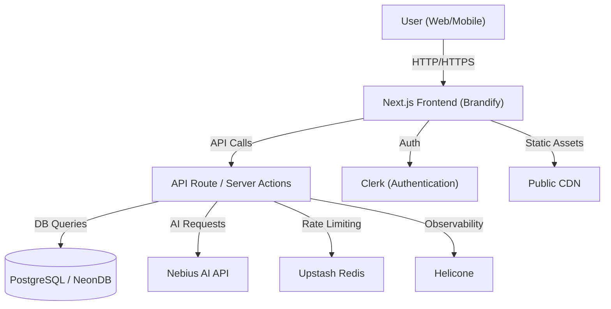
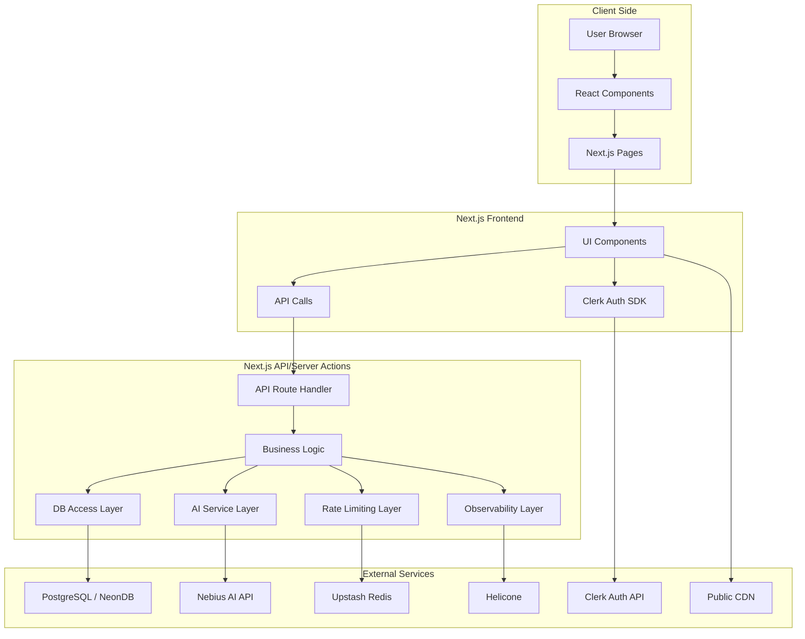

# Brandify - AI-Powered Logo Generator

Brandify is a modern, full-stack AI-powered logo generator. Instantly create, customize, and download professional logos for your brand, with a beautiful, original UI and robust backend.

---

## 🚀 Features
- AI-powered logo generation (Nebius AI)
- Multiple styles, colors, and sizes
- User authentication (Clerk)
- Logo history and gallery
- Rate limiting (Upstash Redis)
- Observability (Helicone)
- Responsive, modern UI
- Download logos in high quality

---

## 🛠️ Tech Stack
- **Frontend:** Next.js (App Router), React, Tailwind CSS
- **Backend:** Next.js API routes / Server Actions
- **Database:** PostgreSQL (NeonDB)
- **AI:** Nebius AI
- **Authentication:** Clerk
- **Rate Limiting:** Upstash Redis
- **Observability:** Helicone

---

## 🏗️ System Design



| Component                | Description                                                                 |
|--------------------------|-----------------------------------------------------------------------------|
| **User (Web/Mobile)**    | The end user accessing Brandify from a browser or mobile device.            |
| **Next.js Frontend**     | The main React-based UI, built with Next.js, serving all pages and assets.  |
| **API Route/Server Actions** | Handles backend logic, API requests, and server-side actions in Next.js.     |
| **PostgreSQL / NeonDB**  | The main database for storing user data, logo history, etc.                 |
| **Nebius AI API**        | External AI service for generating logos based on user input.               |
| **Upstash Redis**        | Provides rate limiting to prevent abuse and manage quotas.                  |
| **Helicone**             | Observability and analytics for API usage and performance.                  |
| **Clerk (Authentication)** | User authentication and session management.                                 |
| **Public CDN**           | Serves static assets (images, icons, etc.) for fast global delivery.        |

---

## 🧩 Low-Level System Design & Architecture



| Component                | Description                                                                 |
|--------------------------|-----------------------------------------------------------------------------|
| **User Browser**         | Where the user interacts with the app.                                      |
| **React Components**     | UI building blocks for the app.                                             |
| **Next.js Pages**        | Page-level routing and rendering.                                           |
| **UI Components**        | Buttons, cards, forms, etc.                                                 |
| **API Calls**            | Fetch/axios requests to backend/server actions.                             |
| **Clerk Auth SDK**       | Handles authentication in the frontend.                                     |
| **API Route Handler**    | Receives and processes API requests.                                        |
| **Business Logic**       | Core logic for logo generation, validation, etc.                            |
| **DB Access Layer**      | Reads/writes data to the database.                                          |
| **AI Service Layer**     | Communicates with Nebius AI for logo generation.                            |
| **Rate Limiting Layer**  | Checks and enforces user quotas.                                            |
| **Observability Layer**  | Sends logs/metrics to Helicone.                                             |
| **External Services**    | NeonDB, Nebius AI, Upstash, Helicone, Clerk API, Public CDN.                |

---

## ⚡ Quickstart

1. **Clone the repo:**
   ```bash
   git clone https://github.com/Divyanshu0230/logo-generator.git
   cd logo-generator
   ```
2. **Install dependencies:**
   ```bash
   npm install
   ```
3. **Set up environment variables:**
   - Copy `.env.example` to `.env.local` and fill in your keys (NeonDB, Nebius, Clerk, Upstash, Helicone)
4. **Run database migrations:**
   ```bash
   npx drizzle-kit migrate
   ```
5. **Start the dev server:**
   ```bash
   npm run dev
   ```
6. **Open [http://localhost:3000](http://localhost:3000)**

---

## 🌐 Deployment
- **Vercel (Recommended):** Import your repo, add env vars, and deploy.
- **Render:** Supported, but may require custom build/start commands.

---

## 👤 Author
- **Divyanshu Pratap Singh**  
  [GitHub](https://github.com/Divyanshu0230) | [LinkedIn](https://www.linkedin.com/in/divyanshu-pratap-singh-304546251/)

---

## 📄 License
MIT License. See [LICENSE](LICENSE) for details.
