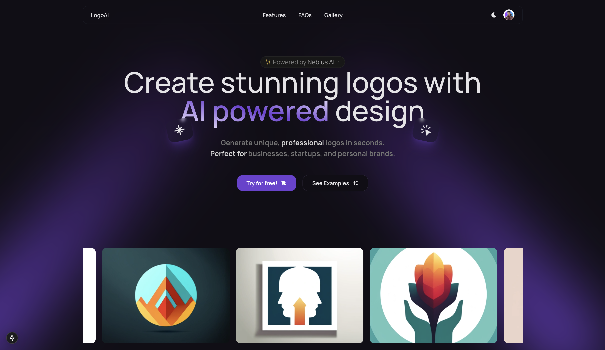

# Brandify - AI-Powered Logo Generator



[Brandify](https://brandify.ai) is a next-generation web application that leverages artificial intelligence to create stunning, professional logos in seconds. Built with Next.js, TypeScript, and powered by Nebius AI, Brandify offers a seamless, modern experience for building your brand identity.

## Features

- **AI-Powered Logo Generation**: Instantly create unique logos using advanced AI models
- **Multiple AI Models**: Choose from a variety of creative models
- **Rate Limiting**: Fair usage for all users
- **Customization Options**:
  - Multiple style presets (Minimal, Tech, Corporate, Creative, Abstract, Flashy)
  - Custom color selection
  - Various size options (256x256, 512x512, 1024x1024)
  - Quality settings (Standard, HD)
- **User History**: Track and manage your generated logos
- **Public Gallery**: Browse logos created by the community
- **Secure Authentication**: Powered by Clerk
- **Database Integration**: PostgreSQL with Drizzle ORM

## Tech Stack

- **Frontend**: Next.js, TypeScript
- **Styling**: Tailwind CSS, Shadcn UI
- **Authentication**: Clerk
- **Database**: PostgreSQL (NeonDB)
- **Rate Limiting**: Upstash Redis
- **ORM**: Drizzle ORM
- **AI Integration**: Nebius AI
- **Animations**: Framer Motion
- **Deployment**: Vercel
- **Observability**: Helicone

## Getting Started

### Prerequisites

Before you begin, you'll need to create accounts and obtain API keys from the following services:

- [Node.js 18+](https://nodejs.org/en/download/)
- [NeonDB Account](https://neon.tech/) - For PostgreSQL database
- [Nebius AI Account](https://dub.sh/nebius) - For AI model access
- [Clerk Account](https://clerk.com/) - For authentication
- [Vercel Account](https://vercel.com/) - For deployment
- [Upstash Account](https://upstash.com/) - For Ratelimiting
- [Helicone Account](https://www.helicone.ai/) - For Observability

### Environment Variables

Create a `.env.local` file in the root directory with the following variables:

```env
# Database (from NeonDB)
POSTGRES_URL=your_postgres_connection_string

# AI (from Nebius AI Studio)
NEBIUS_API_KEY=your_nebius_api_key

# Auth (from Clerk Dashboard)
NEXT_PUBLIC_CLERK_PUBLISHABLE_KEY=your_clerk_publishable_key
CLERK_SECRET_KEY=your_clerk_secret_key

# Rate Limiting (from Upstash)
UPSTASH_REDIS_REST_URL=your_upstash_redis_url
UPSTASH_REDIS_REST_TOKEN=your_upstash_redis_token

# Observability (from Helicone)
HELICONE_API_KEY=your_helicone_api_key

# Development
NEXT_PUBLIC_DEVELOPMENT_URL=http://localhost:3000
```

### Installation

1. Clone the repository:

```bash
git clone https://github.com/Divyanshu0230/brandify.git
cd brandify
```

2. Install dependencies:

```bash
npm install
```

3. Run database migrations:

```bash
npx drizzle-kit migrate
```

4. Start the development server:

```bash
npm run dev
```

5. Open [http://localhost:3000](http://localhost:3000) with your browser to see the result.

### Docker Deployment

1. Build the Docker Compose image:

```bash
docker compose up -d --build
```

2. Or, build the Docker image and run the container:

```bash
docker build -t brandify .
docker run -p 3000:3000 \
  -e NEBIUS_API_KEY=$NEBIUS_API_KEY \
  -e NEXT_PUBLIC_CLERK_PUBLISHABLE_KEY=$NEXT_PUBLIC_CLERK_PUBLISHABLE_KEY \
  -e CLERK_SECRET_KEY=$CLERK_SECRET_KEY \
  brandify
```

## Project Structure

```
├── app/
│   ├── actions/        # Server actions
│   ├── gallery/        # Public gallery page
│   ├── generate/       # Logo generation page
│   ├── history/        # User history page
│   └── page.tsx        # Landing page
├── components/         # UI components
├── db/
│   ├── index.ts        # Database configuration
│   └── schema.ts       # Database schema
├── lib/
│   ├── domain.ts       # Domain configuration
│   └── upstash.ts      # Rate limiting configuration
├── public/            # Static assets
└── middleware.ts      # Rate limiting middleware
```

## Author & Links

- **GitHub:** [Divyanshu0230](https://github.com/Divyanshu0230)
- **LinkedIn:** [Divyanshu Pratap Singh](https://www.linkedin.com/in/divyanshu-pratap-singh-304546251/)

## License

This project is licensed - see the [LICENSE](LICENSE) file for details.

## Support

For support, please open an issue in the GitHub repository or contact the maintainer.
